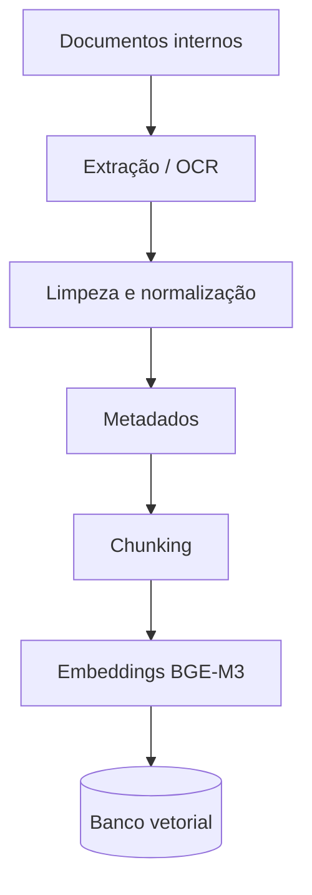
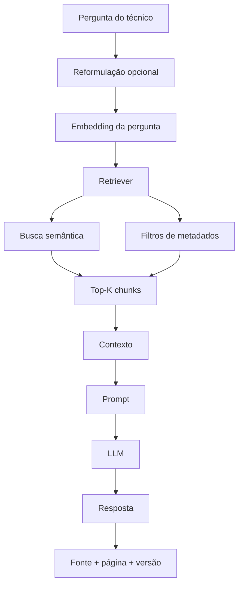
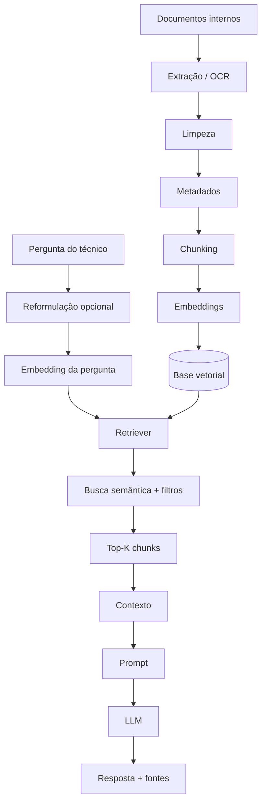
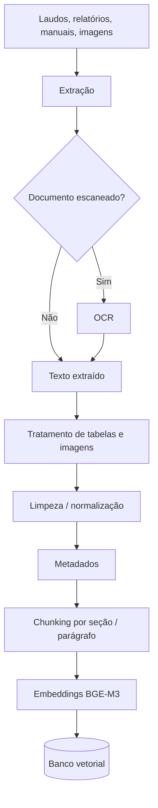
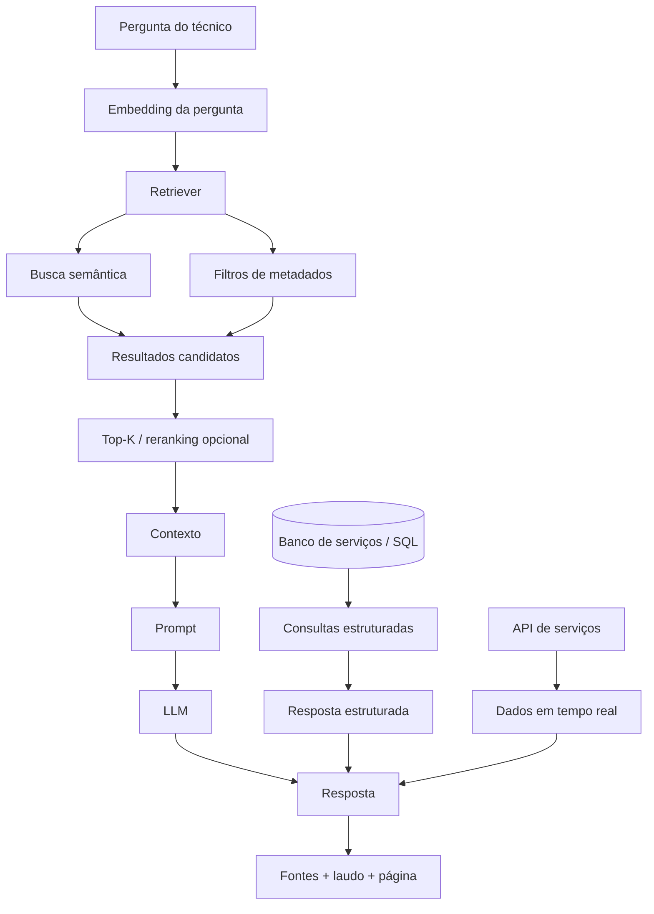
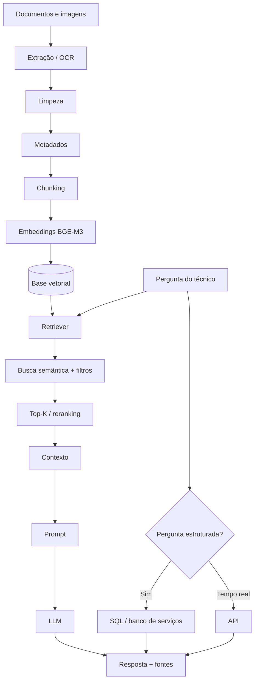
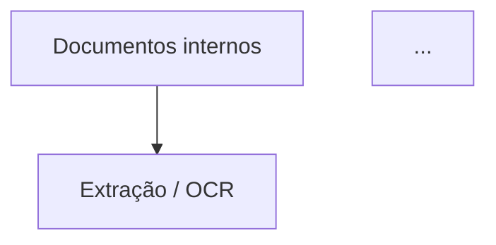
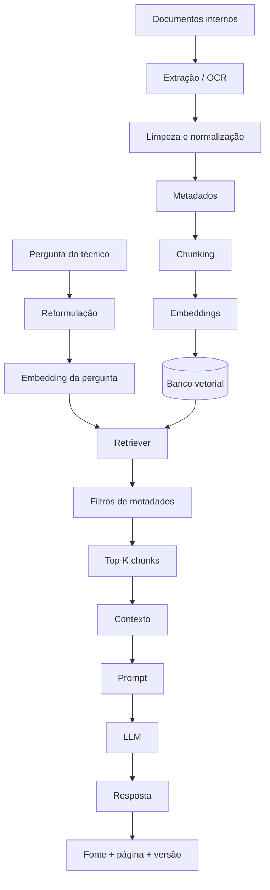
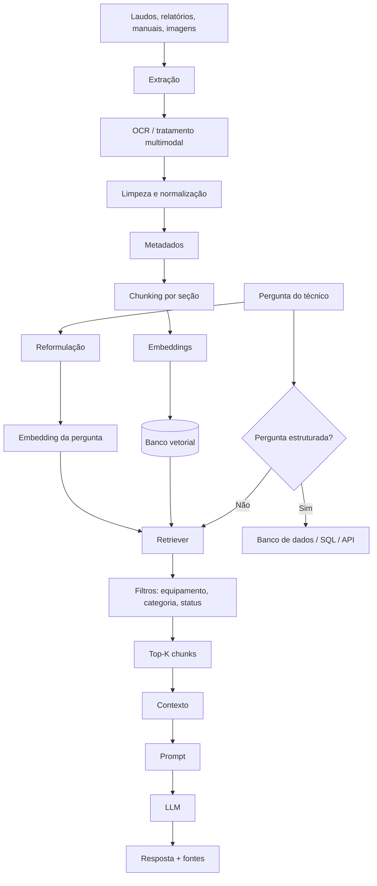

# Atividade AULA 06 — Projeto de Arquiteturas RAG

## Cenário 1 — Suporte de TI
## Cenário 2 — Diagnóstico de vazamentos

---

# 1. Cenário 1 — Suporte de TI

## Parte 1 — Identificação dos problemas

### 1.1 Descrição do problema

Uma empresa possui documentação de suporte de TI espalhada em manuais, procedimentos internos, bases de conhecimento, registros de incidentes e documentos de configuração. O objetivo é permitir que técnicos encontrem rapidamente procedimentos confiáveis para resolver problemas recorrentes.

O usuário principal é o técnico de suporte de TI, que possui conhecimento técnico e utiliza o sistema durante o atendimento de chamados. A aplicação será disponibilizada por uma interface web, podendo futuramente ser integrada ao sistema de chamados por API.

As informações consultadas incluem procedimentos de atendimento, configuração de sistemas, soluções para incidentes, manuais, procedimentos de VPN, rede, sistemas operacionais e instruções internas.

Um LLM sozinho não seria suficiente porque não conhece os procedimentos privados da empresa, suas configurações específicas e suas versões atuais.

**Perguntas reais:**

1. “O usuário não consegue acessar a VPN. O que eu faço?”
2. “Como faço para configurar o acesso desse usuário ao sistema?”
3. “Já tivemos algum problema parecido com esse erro?”

### 1.2 Por que RAG?

RAG é adequado porque permite recuperar a documentação interna no momento da pergunta e fornecer esse conteúdo ao LLM como contexto. Assim, quando um procedimento for alterado, a empresa pode atualizar a base sem precisar treinar novamente o modelo.

O conhecimento utilizado inclui manuais, procedimentos, registros de incidentes, instruções de configuração e documentação interna. Alguns documentos mudam mensalmente ou quando há alteração de sistemas; registros de chamados entram com maior frequência.

Exemplo de erro de um LLM sem RAG: ao perguntar como resolver uma falha de VPN, o modelo poderia sugerir um procedimento genérico que não corresponde à configuração utilizada pela empresa, como alterar uma configuração que não existe ou ignorar uma etapa obrigatória de autenticação.

### 1.3 Limitações — quando RAG não é a resposta

**Busca por palavra-chave:** pode ser melhor quando o técnico conhece exatamente o código do erro, por exemplo `ERR_VPN_403`.

**Banco de dados + SQL:** é melhor para perguntas como “quantos chamados de VPN foram abertos neste mês?”, porque envolve contagem e filtros estruturados.

**Regras determinísticas:** são melhores quando existe um fluxo fixo, como verificar conectividade, validar credenciais e então executar uma ação específica.

**API direta:** é melhor para informações em tempo real, como status de um servidor, disponibilidade de um serviço ou situação de um chamado.

**Combinação:** a arquitetura pode combinar RAG para documentação, SQL para dados estruturados e APIs para informações em tempo real.

Uma pergunta que RAG responderia mal seria: “Quantos computadores estão com Windows 11?”. Se a informação estiver em registros estruturados, SQL é mais preciso para contar, filtrar, agrupar e ordenar.

Se a pergunta exigir contar, somar ou ordenar informações espalhadas por muitos documentos, a aplicação deve encaminhar a consulta para uma fonte estruturada ou usar uma combinação de RAG com ferramentas de consulta. O RAG sozinho não é uma garantia de cálculo completo sobre toda a base.

---

# Parte 2 — Organização dos documentos

### Tipos e volume

- PDF e DOCX: manuais e procedimentos.
- HTML/Markdown: artigos da base de conhecimento.
- Planilhas: alguns inventários e controles, quando forem relevantes.
- Registros de chamados exportados do sistema.

Inicialmente, a base teria centenas de documentos, podendo chegar a milhares. Manuais normalmente possuem 10–100 páginas; procedimentos têm aproximadamente 2–20 páginas; artigos de suporte são menores.

Novos chamados e artigos podem entrar diariamente. Manuais e procedimentos são atualizados conforme mudanças nos sistemas.

### Organização

```text
documentos/
├── procedimentos/
├── manuais/
├── base_conhecimento/
├── incidentes/
├── sistemas/
└── outros/
```

A divisão acompanha a forma como o técnico procura a informação: procedimento, sistema, incidente ou manual. Também facilita filtros posteriores.

### Documentos que não devem entrar

Não devem entrar documentos sem autorização, dados pessoais desnecessários, senhas, tokens, chaves, informações financeiras e documentos obsoletos. A entrada deve passar por validação de origem, classificação e permissão.

### Controle de versões

Cada documento terá versão e status. Quando uma versão nova for publicada, ela será marcada como `vigente` e a anterior como `obsoleta`.

Na busca normal, o filtro `status = vigente` evita recuperar uma instrução antiga como se fosse atual.

---

# Parte 3 — Pipeline de ingestão

```text
Documentos
    ↓
Extração / OCR
    ↓
Limpeza e normalização
    ↓
Metadados
    ↓
Chunking
    ↓
Embeddings
    ↓
Banco vetorial
```

## 3.1 Extração

PDFs com texto selecionável terão o texto extraído diretamente. PDFs digitalizados passarão por OCR.

Comandos, códigos de erro, caminhos de arquivos, tabelas e títulos precisam ser preservados, pois podem ser justamente os elementos usados pelo técnico para encontrar a solução.

Tabelas que contenham configurações ou códigos serão convertidas para texto estruturado. Imagens puramente decorativas podem ser descartadas, mas diagramas de rede, telas de configuração e fluxogramas relevantes devem ser preservados ou descritos.

Um problema possível é o OCR interpretar incorretamente um código ou comando. Em suporte de TI, trocar um caractere de um comando pode tornar a orientação incorreta.

## 3.2 Limpeza e normalização

Serão removidos cabeçalhos e rodapés repetidos, numeração de página, marcas d'água e duplicações que não tenham valor para a busca.

Serão padronizados espaços, quebras de linha, codificação, datas e nomenclaturas quando necessário.

A limpeza não pode remover códigos de erro, comandos, nomes de sistemas, números de versão ou parâmetros de configuração.

## 3.3 Frequência de ingestão

A ingestão pode rodar diariamente e também sob demanda quando um documento crítico for atualizado.

O sistema identifica alterações por `document_id`, versão, data de atualização e hash do arquivo. Quando apenas um documento muda, somente ele e seus chunks são reprocessados.

---

# Parte 4 — Metadados

## Metadados do documento

```json
{
  "document_id": "VPN-001",
  "title": "Manual de VPN",
  "author": "Equipe de TI",
  "source": "base_interna",
  "document_type": "manual",
  "created_at": "2026-01-10",
  "updated_at": "2026-08-01",
  "category": "vpn",
  "system": "VPN",
  "version": "3.2",
  "status": "vigente",
  "access_level": "tecnico"
}
```

**Justificativas:** `document_id` relaciona documento e chunks; `title` identifica a fonte; `author` registra responsável; `source` mostra a origem; `document_type` permite diferenciar manual, procedimento e incidente; datas ajudam no controle; `category` e `system` permitem filtros; `version` e `status` evitam recuperar documentação antiga; `access_level` auxilia no controle de acesso.

## Metadados do chunk

```json
{
  "document_id": "VPN-001",
  "chunk_id": "VPN-001-05",
  "page": 8,
  "section": "Falha de autenticação",
  "document_type": "manual",
  "system": "VPN",
  "category": "vpn",
  "version": "3.2",
  "status": "vigente",
  "access_level": "tecnico",
  "text": "..."
}
```

### Filtros

Pergunta: “Como resolver uma falha de acesso à VPN?”

Filtros possíveis: `system = VPN`, `status = vigente` e `access_level = permitido`.

### Citação

A tela exibiria, por exemplo:

> Fonte: Manual de VPN — versão 3.2 — seção “Falha de autenticação” — página 8.

### Metadado difícil de acrescentar depois

`document_id`, versão, status e informações de classificação são importantes desde o início. Se os chunks já estiverem indexados sem essas relações, será necessário reprocessar documentos para recuperar e classificar a informação corretamente.

Os metadados podem ser extraídos automaticamente quando forem claros, mas campos críticos como `status`, `version` e `access_level` devem vir de uma fonte controlada.

---

# Parte 5 — Chunking / Splitting

Para a documentação de TI será usado splitting recursivo, priorizando títulos, parágrafos e quebras naturais antes de dividir por caracteres.

A configuração inicial será de aproximadamente **800–1.000 caracteres**, com **150–200 caracteres de overlap**. A justificativa é manter um procedimento ou explicação de erro dentro de um mesmo chunk sem gerar blocos muito grandes. O overlap reduz a chance de perder a relação entre uma explicação e a etapa seguinte quando a divisão ocorrer no meio de um procedimento.

Documentos com estrutura muito clara podem ser divididos por seção. Procedimentos devem manter etapas relacionadas juntas. Tabelas pequenas devem permanecer inteiras; tabelas grandes podem ser divididas mantendo o cabeçalho em cada parte.

Se os chunks forem muito pequenos, informações como erro, causa e solução podem ficar separadas. Se forem muito grandes, a recuperação pode trazer conteúdo demais e diminuir a precisão.

A escolha será validada com perguntas reais de suporte e comparação entre configurações. Uma configuração será considerada melhor se recuperar os trechos corretos, com contexto suficiente e fonte correta.

---

# Parte 6 — Embeddings

O modelo escolhido é o **BAAI/bge-m3**. Ele possui dimensão de 1024 e suporta entradas de até 8192 tokens, além de mais de 100 idiomas. O modelo também suporta diferentes formas de recuperação, incluindo dense e sparse retrieval. citeturn0search0turn0academia24

A escolha faz sentido porque a documentação da empresa pode conter português, inglês, nomes técnicos, códigos e termos específicos. O modelo pode ser executado localmente, o que é interessante para uma empresa que não queira enviar documentação interna para uma API externa.

Também foi considerada uma alternativa baseada em embeddings via API, mas para este cenário a possibilidade de manter o processamento local pesa a favor do BGE-M3. A decisão final ainda deveria ser validada com um conjunto de perguntas reais da empresa.

O tamanho do embedding não determina sozinho o tamanho do chunk. Porém, o limite de 8192 tokens do BGE-M3 mostra que o modelo aceita textos longos; mesmo assim, não é desejável usar chunks enormes. O objetivo do chunking é recuperar unidades de informação coerentes, não simplesmente ocupar o limite máximo do modelo. citeturn0search0

---

# Arquitetura final — Cenário 1

## Pré-produção



## Produção



## Fluxo completo



## Tabela de decisões

| Etapa | Decisão | Justificativa |
|---|---|---|
| Extração | PDF/DOCX/HTML + OCR | A documentação pode chegar em diferentes formatos. |
| Limpeza | Remover ruídos preservando comandos, códigos e tabelas | Esses elementos podem ser necessários para resolver o incidente. |
| Metadados | Documento, chunk, sistema, versão, status e acesso | Permitem filtros, rastreabilidade e controle de versão. |
| Chunking | Recursivo, 800–1.000 caracteres | Mantém unidades de informação sem excesso de contexto. |
| Overlap | 150–200 caracteres | Reduz perda de contexto nas fronteiras. |
| Embeddings | BAAI/bge-m3 | Multilíngue, local e adequado a recuperação semântica. |
| Retriever | Busca semântica + filtros | Combina similaridade e regras de negócio. |
| Top-K | Seleção dos melhores chunks | Evita enviar documentos irrelevantes ao LLM. |
| LLM | Responder com base no contexto | Reduz dependência do conhecimento pré-treinado. |
| Citação | Documento, seção, página e versão | Permite conferência pelo técnico. |

## Riscos e limitações

1. Documentação desatualizada pode gerar orientação incorreta. Mitigação: versão e status.
2. OCR pode alterar códigos ou comandos. Mitigação: validação.
3. O retriever pode recuperar conteúdo parecido, mas não resolver o problema. Mitigação: filtros, reformulação e avaliação.
4. Chunking inadequado pode separar causa e solução. Mitigação: testes com perguntas reais.
5. O LLM pode interpretar o contexto de forma incorreta. Mitigação: instruir a responder somente com evidências recuperadas e admitir quando não houver informação suficiente.
6. `access_level` não substitui autorização real. O sistema deve verificar a identidade e permissão antes de liberar o conteúdo.
7. RAG não é adequado para contagens e agregações em grandes conjuntos de registros. SQL deve ser usado nesses casos.
8. Se a empresa não documentou uma solução, o RAG não cria esse conhecimento.

---

# 2. Cenário 2 — Diagnóstico de vazamentos

## Parte 1 — Identificação dos problemas

### 1.1 Descrição do problema

Uma empresa de caça-vazamentos possui informações técnicas espalhadas em laudos, relatórios de serviços, procedimentos, manuais de equipamentos e registros de atendimentos anteriores. Durante uma vistoria, o técnico pode precisar consultar rapidamente como determinado problema foi diagnosticado ou qual procedimento foi utilizado em uma situação semelhante.

A aplicação será utilizada principalmente por técnicos de caça-vazamentos em campo, que possuem conhecimento de hidráulica e experiência prática, mas podem precisar consultar informações específicas da empresa durante o atendimento.

O sistema será disponibilizado por uma interface web adaptada para celular.

As informações incluem procedimentos de diagnóstico, métodos de detecção, laudos anteriores, resultados de testes, tipos de vazamento, soluções utilizadas, manuais dos equipamentos e ocorrências semelhantes.

Um LLM sozinho não seria suficiente porque não conhece os equipamentos específicos utilizados pela empresa, os procedimentos internos nem os casos anteriores registrados pela equipe.

**Perguntas reais:**

1. “Já tivemos algum caso parecido com esse vazamento na coluna hidráulica?”
2. “Qual procedimento usamos quando o teste de estanqueidade apresenta esse resultado?”
3. “Esse equipamento pode ser usado para localizar vazamento em tubulação enterrada?”

### 1.2 Por que RAG?

RAG permite consultar o conhecimento técnico acumulado sem precisar treinar novamente o modelo sempre que um novo laudo ou procedimento for incluído.

O modelo receberá laudos, relatórios de vistoria, procedimentos internos, manuais de equipamentos, registros de serviços anteriores e resultados de testes.

Novos serviços podem ser registrados diariamente, enquanto procedimentos e manuais são atualizados quando há mudanças nos equipamentos ou métodos de trabalho.

Os documentos são privados e específicos da empresa.

Exemplo de resposta errada de um LLM sozinho: o modelo poderia recomendar um método genérico de utilização de determinado equipamento que não corresponde ao modelo realmente utilizado pela empresa.

### 1.3 Limitações — quando RAG não é a resposta

**Busca tradicional por palavra-chave:** funciona bem quando o técnico conhece o termo exato usado no laudo, como “vazamento coluna 3º andar”.

**Banco de dados + SQL:** é melhor para perguntas estruturadas, como “Quantos serviços foram realizados em agosto?”.

**Regras determinísticas:** são melhores para sequências totalmente definidas, como verificar pressão, realizar teste, analisar resultado e seguir o procedimento correspondente.

**API direta:** é melhor para dados em tempo real, como status de serviço, endereço, técnico responsável, equipamento disponível e horário.

**Combinação:** RAG para documentação, banco de dados para registros estruturados e API para informações atualizadas.

Pergunta que SQL responderia melhor: “Quantos vazamentos foram identificados em imóveis comerciais nos últimos seis meses?”.

Se a pergunta exigir contar, somar ou ordenar dados espalhados por muitos laudos, o sistema deve encaminhar a consulta para uma fonte estruturada ou combinar RAG com ferramenta de consulta.

---

# Parte 2 — Organização dos documentos

### Tipos de arquivo

- PDF;
- DOCX;
- planilhas;
- Markdown;
- imagens;
- manuais de equipamentos;
- laudos técnicos;
- relatórios de serviço.

As imagens são especialmente importantes porque fotografias podem registrar o local da ocorrência, equipamentos, pontos de acesso e evidências encontradas durante a vistoria.

Inicialmente, a base teria centenas de documentos, podendo chegar a milhares. Laudos têm aproximadamente 2–15 páginas; relatórios, 1–10 páginas; manuais, 10–100 páginas. Fotografias ficam associadas ao serviço.

Novos relatórios e laudos podem entrar diariamente. Manuais e procedimentos são atualizados com menor frequência.

### Organização

```text
documentos/
├── laudos/
├── relatorios/
├── procedimentos/
├── equipamentos/
├── servicos/
└── imagens/
```

A estrutura acompanha a forma como o técnico pensa a informação: serviço → problema → equipamento → procedimento → resultado. Também facilita filtros como `document_type`, `equipment` e `service_type`.

### Documentos que não devem entrar

Não devem entrar documentos sem autorização, dados pessoais desnecessários, informações financeiras, documentos obsoletos, arquivos sem relação com o diagnóstico e fotografias sem finalidade técnica.

Antes da ingestão, os arquivos passam por validação de origem, tipo, classificação e permissão. Dados pessoais desnecessários devem ser removidos ou anonimizados.

### Controle de versões

Procedimentos e manuais terão versão, data e status. A nova versão será marcada como `vigente`; a anterior permanecerá para histórico como `obsoleta`.

Na recuperação normal será aplicado `status = vigente`.

---

# Parte 3 — Pipeline de ingestão

```text
Documentos
    ↓
Extração
    ↓
OCR quando necessário
    ↓
Limpeza / normalização
    ↓
Metadados
    ↓
Chunking / Splitting
    ↓
Embeddings
    ↓
Banco vetorial
```

## 3.1 Extração

PDFs com texto selecionável terão o texto extraído diretamente. PDFs digitalizados passarão por OCR.

Em laudos técnicos é importante preservar identificação do equipamento, resultados de testes, medidas, tabelas, conclusões e referências às imagens.

Tabelas são importantes porque podem conter resultados de testes, medições e comparações. Quando possível, serão transformadas em texto estruturado mantendo a relação entre valores e campos.

Imagens técnicas não serão automaticamente descartadas. Fotografias podem mostrar local do vazamento, equipamento utilizado, ponto de acesso, danos aparentes e resultado visual da inspeção. Quando necessário, a imagem receberá uma descrição textual associada ao documento.

Um laudo pode ser multimodal: texto + tabelas + fotografias. O texto será extraído, as tabelas estruturadas e as imagens relevantes associadas ao documento. Áudios e vídeos não serão a principal fonte, mas gravações de inspeção podem ser transcritas se contiverem informações técnicas relevantes.

Problemas possíveis: OCR incorreto, números interpretados errado, unidades alteradas, tabelas desestruturadas, imagens sem contexto e texto fora de ordem. Em um laudo técnico, confundir um valor de pressão ou unidade pode gerar interpretação errada.

## 3.2 Limpeza e normalização

Podem ser removidos cabeçalhos repetidos, rodapés, numeração de páginas, marcas d'água, duplicações e informações administrativas sem valor técnico.

Devem ser padronizados espaçamento, quebras de linha, codificação, unidades quando houver inconsistência, datas e nomenclatura dos equipamentos.

A limpeza não pode remover medições, códigos, unidades, nomes de equipamentos, resultados de testes ou conclusões técnicas.

## 3.3 Frequência de ingestão

O pipeline será executado diariamente, verificando novos laudos, relatórios e procedimentos.

Quando um documento for atualizado, somente ele será reprocessado. A alteração poderá ser identificada por `document_id`, versão, data de atualização e hash do arquivo.

---

# Parte 4 — Metadados

## 4.1 Metadados do documento

```json
{
  "document_id": "LAUDO-001",
  "title": "Laudo de detecção de vazamento",
  "author": "Equipe Técnica",
  "source": "sistema/servicos",
  "document_type": "laudo",
  "created_at": "2026-08-10",
  "updated_at": "2026-08-10",
  "category": "vazamento_oculto",
  "equipment": "geofone",
  "service_type": "residencial",
  "version": "1.0",
  "status": "vigente",
  "access_level": "tecnico"
}
```

| Metadado | Importância |
|---|---|
| `document_id` | Identifica o documento e relaciona seus chunks. |
| `title` | Permite identificar a fonte. |
| `author` | Identifica o responsável. |
| `source` | Permite localizar a origem. |
| `document_type` | Diferencia laudo, relatório, manual e procedimento. |
| `created_at` | Registra a criação. |
| `updated_at` | Ajuda a identificar alterações. |
| `category` | Permite filtrar pelo tipo de problema. |
| `equipment` | Permite restringir resultados ao equipamento. |
| `service_type` | Diferencia residencial e comercial, por exemplo. |
| `version` | Controla versões. |
| `status` | Diferencia documentos vigentes e obsoletos. |
| `access_level` | Auxilia no controle de acesso. |

## 4.2 Metadados do chunk

```json
{
  "document_id": "LAUDO-001",
  "chunk_id": "LAUDO-001-03",
  "page": 4,
  "section": "Resultado da inspeção",
  "document_type": "laudo",
  "category": "vazamento_oculto",
  "equipment": "geofone",
  "service_type": "residencial",
  "version": "1.0",
  "status": "vigente",
  "access_level": "tecnico",
  "text": "..."
}
```

### Filtros

Pergunta: “Quais casos anteriores tivemos de vazamento oculto detectado com geofone?”

Filtros: `category = vazamento_oculto`, `equipment = geofone`, `status = vigente`.

### Citação

> Fonte: Laudo de detecção de vazamento — Resultado da inspeção — página 4.

### Metadados difíceis de acrescentar depois

`document_id` é essencial para relacionar cada chunk ao documento original. Também seria trabalhoso acrescentar posteriormente `equipment`, `version`, `status` e outras classificações se elas forem necessárias para filtros, pois seria necessário revisar ou reprocessar documentos.

Alguns metadados vêm diretamente do sistema de serviços. Outros, como categoria e equipamento, podem ser identificados pelo conteúdo. Metadados críticos, principalmente `status`, `version` e `access_level`, devem vir de fonte controlada.

---

# Parte 5 — Chunking / Splitting

Para laudos e relatórios, a estrutura do documento é importante. Será priorizada uma divisão por seções e parágrafos, utilizando splitter recursivo como fallback quando uma seção for grande demais.

A configuração inicial será de **600–900 caracteres**, com **100–150 caracteres de overlap**. A escolha é um pouco menor que no cenário de TI porque o laudo descreve uma ocorrência específica e queremos evitar misturar diagnóstico, medição e conclusão de situações diferentes.

**Laudos:** dividir por seções, mantendo problema, método, resultado e conclusão relacionados.

**Relatórios:** preservar a sequência do atendimento.

**Procedimentos:** manter cada etapa junto das informações necessárias para executá-la.

**Manuais:** dividir por seções e subseções.

**Tabelas:** manter inteira quando possível; se for muito grande, dividir por linhas mantendo o cabeçalho em cada parte.

**Imagens:** não serão divididas como texto; permanecem associadas ao documento e podem receber descrição textual.

Chunks muito pequenos podem separar o resultado de um teste da explicação do que ele significa. Chunks muito grandes podem misturar diferentes etapas do diagnóstico e diminuir a precisão da recuperação.

A avaliação será feita com perguntas reais, verificando se os chunks recuperados correspondem ao problema, contêm informação suficiente, recuperam o caso correto e apresentam a fonte correta. Diferentes tamanhos serão comparados antes de definir a configuração final.

---

# Parte 6 — Embeddings

Também será utilizado o **BAAI/bge-m3**. O modelo é multilíngue, suporta mais de 100 idiomas, possui dimensão 1024 e aceita entradas de até 8192 tokens. Além da recuperação densa, o BGE-M3 suporta mecanismos de recuperação esparsa e multi-vector. citeturn0search0turn0academia24

A escolha é adequada porque os laudos são escritos principalmente em português, mas podem conter nomes de equipamentos, termos técnicos e documentação em inglês. Outro ponto importante é a possibilidade de execução local, que reduz a necessidade de enviar laudos e informações privadas da empresa para uma API externa.

Foi considerada a utilização de um serviço de embeddings por API, mas neste cenário a privacidade pesa mais na decisão. Como a base contém laudos e histórico de serviços, prefiro inicialmente uma solução local, desde que a infraestrutura da empresa consiga suportar o modelo.

O limite de entrada também influencia o chunking. Apesar de o modelo suportar até 8192 tokens, os chunks escolhidos são muito menores. Isso é intencional: o objetivo é que cada vetor represente uma unidade de informação recuperável, e não um laudo inteiro. citeturn0search0

Uma possibilidade futura é utilizar recuperação híbrida. A própria documentação do BGE-M3 recomenda combinar recuperação híbrida com reranking, especialmente quando termos exatos também são importantes. Isso seria útil para nomes e modelos de equipamentos, códigos e unidades de medida. citeturn0search0

---

# Arquitetura final — Cenário 2

## Pré-produção



## Produção



## Fluxo completo



## Tabela de decisões

| Etapa | Decisão | Justificativa |
|---|---|---|
| Extração | PDF/DOCX + OCR + tratamento multimodal | Laudos podem conter texto, tabelas e imagens. |
| Limpeza | Remover ruídos sem eliminar medições | Valores e unidades são essenciais para diagnóstico. |
| Metadados | Problema, equipamento, tipo de serviço, versão e status | Permitem recuperar casos realmente semelhantes. |
| Chunking | Seções/parágrafos + splitter recursivo | Mantém o contexto técnico de cada ocorrência. |
| Tamanho | 600–900 caracteres | Evita misturar partes diferentes do diagnóstico. |
| Overlap | 100–150 caracteres | Preserva contexto entre fronteiras. |
| Embeddings | BAAI/bge-m3 | Multilíngue, local e adequado a recuperação semântica. |
| Retriever | Busca semântica + filtros | Combina significado e características do serviço. |
| SQL | Consultas estruturadas | Contagens e agregações são mais confiáveis em dados estruturados. |
| API | Dados operacionais em tempo real | Evita usar documentos como fonte de estado atual. |
| LLM | Resposta baseada no contexto | Facilita interpretar laudos e apresentar uma síntese. |
| Citação | Laudo, seção e página | Permite verificar a evidência original. |

## Riscos e limitações

1. OCR pode alterar números, unidades ou termos técnicos.
2. Uma imagem pode ser relevante, mas uma descrição automática pode perder detalhes.
3. Casos semelhantes não significam necessariamente a mesma causa.
4. Um laudo antigo pode ser recuperado se o controle de versão estiver incorreto.
5. O RAG não substitui a avaliação técnica presencial.
6. O LLM pode combinar evidências de casos diferentes de forma indevida.
7. Contagens e agregações devem usar banco estruturado.
8. A qualidade da resposta depende da qualidade dos laudos e procedimentos registrados pela empresa.

---

# 3. Comparação entre os dois cenários

| Aspecto | Suporte de TI | Diagnóstico de vazamentos |
|---|---|---|
| Usuário | Técnico de suporte | Técnico de caça-vazamentos em campo |
| Informação principal | Procedimentos, manuais e incidentes | Laudos, casos anteriores, procedimentos e equipamentos |
| Documentos | Principalmente textuais | Textuais + tabelas + imagens |
| Atualização | Conforme sistemas e procedimentos mudam | Laudos podem entrar diariamente |
| Chunking | 800–1.000 caracteres | 600–900 caracteres |
| Overlap | 150–200 | 100–150 |
| Filtros principais | Sistema, versão, status, acesso | Problema, equipamento, tipo de serviço, status |
| Fonte estruturada complementar | Chamados/inventário | Serviços e atendimentos |
| API complementar | Status de sistemas/chamados | Status de serviços e dados em tempo real |
| Risco principal | Procedimento desatualizado | Interpretação errada de caso semelhante |
| Multimodalidade | Secundária | Importante, principalmente imagens técnicas |

## O que foi igual e por quê?

Nos dois projetos aparecem extração, limpeza, metadados, chunking, embeddings, recuperação e LLM porque essas são etapas gerais de uma arquitetura RAG. Isso não significa que as decisões foram copiadas: o conteúdo e os parâmetros foram adaptados ao tipo de documento e à pergunta do usuário.

Nos dois casos também foi escolhido o BGE-M3. A justificativa é parecida: português, termos técnicos, possibilidade de execução local e necessidade de recuperação semântica. A escolha deverá ser validada com perguntas reais antes de uma implantação definitiva.

## O que foi diferente e por quê?

O Cenário 2 exige tratamento mais cuidadoso de imagens e tabelas, pois elas podem conter evidências do diagnóstico. No Cenário 1, imagens decorativas podem ser descartadas e o foco está em texto, comandos e códigos.

O chunking também foi diferente. No suporte de TI, procedimentos e artigos justificam chunks um pouco maiores. Nos laudos, a ocorrência precisa ser preservada por seção, evitando misturar diagnóstico, medição e conclusão.

O Cenário 2 também precisa de uma integração mais evidente com banco de dados e API, porque perguntas sobre histórico de serviços, contagens e informações operacionais não devem depender apenas do RAG.

## Qual eu construiria primeiro?

Eu escolheria o **Cenário 2 — Diagnóstico de vazamentos**. Além de ser um problema mais específico, ele aproveita uma base de conhecimento que a empresa já produz nos próprios atendimentos. Também permite demonstrar melhor a diferença entre RAG, banco de dados, API e informação multimodal.

Outro motivo é que casos anteriores podem ajudar o técnico a encontrar situações semelhantes, algo que uma busca tradicional por palavras-chave pode não recuperar quando o técnico descreve o problema com palavras diferentes das usadas no laudo.

---

# 4. Referências

- BAAI. **BGE-M3 — Hugging Face**. Disponível em: https://huggingface.co/BAAI/bge-m3
- Chen, J. et al. **BGE M3-Embedding: Multi-Lingual, Multi-Functionality, Multi-Granularity Text Embeddings Through Self-Knowledge Distillation**. arXiv, 2024. Disponível em: https://arxiv.org/abs/2402.03216
- Mermaid. **Mermaid Live Editor**. Disponível em: https://mermaid.live/
- Instituto ECOA PUC-Rio. **TIC em Trilhas — Residência**. Disponível em: https://instituto.ecoa.puc-rio.br/tic-em-trilhas-residencia/

---

# 5. Como utilizei IA na atividade

A IA foi usada como apoio durante o desenvolvimento da atividade para tirar dúvidas sobre RAG, ver as possibilidades de arquitetura, organizar e revisar o texto. Também utilizei a ferramenta para auxiliar na pesquisa inicial sobre modelos de embeddings.

As decisões finais foram analisadas de acordo com cada cenário, e as informações técnicas dos modelos foram conferidas nas fontes indicadas nas referências.

A IA não foi utilizada como substituta da compreensão do projeto. As escolhas de documentos, usuários, filtros, chunking, limitações e integração com banco de dados/API foram relacionadas aos problemas específicos de cada cenário.

---

# 6. Conclusão

Os dois projetos mostram que RAG não deve ser tratado como solução para qualquer tipo de pergunta. Seu principal valor está em recuperar conhecimento contextualizado que não está necessariamente disponível no conhecimento pré-treinado do LLM, especialmente quando esse conhecimento é privado, específico da empresa ou muda ao longo do tempo.

Nos dois cenários, a arquitetura foi pensada separando a construção da base (pré-produção) do momento de consulta (produção). Também foi considerada a necessidade de combinar RAG com mecanismos tradicionais quando a pergunta exigir precisão estrutural, como contagens, somas, ordenações ou informações em tempo real.

flowchart TD
    A[Documentos internos] --> B[Extração / OCR]
    B --> C[Limpeza e normalização]
    C --> D[Metadados]
    D --> E[Chunking]
    E --> F[Embeddings]
    F --> G[(Banco vetorial)]

    H[Pergunta do técnico] --> I[Reformulação]
    I --> J[Embedding da pergunta]
    J --> K[Retriever]
    G --> K
    K --> L[Filtros de metadados]
    L --> M[Top-K chunks]
    M --> N[Contexto]
    N --> O[Prompt]
    O --> P[LLM]
    P --> Q[Resposta]
    Q --> R[Fonte + página + versão]

    flowchart TD
    A[Laudos, relatórios, manuais, imagens] --> B[Extração]
    B --> C[OCR / tratamento multimodal]
    C --> D[Limpeza e normalização]
    D --> E[Metadados]
    E --> F[Chunking por seção]
    F --> G[Embeddings]
    G --> H[(Banco vetorial)]

    I[Pergunta do técnico] --> J[Reformulação]
    J --> K[Embedding da pergunta]
    K --> L[Retriever]
    H --> L
    L --> M[Filtros: equipamento, categoria, status]
    M --> N[Top-K chunks]
    N --> O[Contexto]
    O --> P[Prompt]
    P --> Q[LLM]
    Q --> R[Resposta + fontes]

    I --> S{Pergunta estruturada?}
    S -->|Sim| T[Banco de dados / SQL / API]
    S -->|Não| L




## Diagramas de arquitetura

### Cenário 1 — Suporte de TI



### Cenário 2 — Diagnóstico de vazamentos

